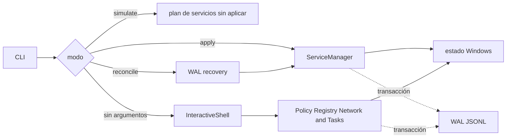

# Aegis11

[](https://isocpp.org/)
[](https://www.microsoft.com/windows/)
[](https://cmake.org/)
[](LICENSE)

Aegis11 es un controlador de políticas para Windows. Su objetivo es aplicar una configuración deseada, registrar los cambios y volver a comprobar el estado cuando el sistema se desvía de esa configuración.

En 30 segundos: `--simulate` muestra el plan de servicios, `--apply` se rechaza porque esa ruta todavía no tiene rollback journaled con paridad y `--reconcile` recupera únicamente el WAL durable. `--snapshot` captura el estado que los módulos soportan sin cargar la ruta de recuperación; los modos son mutuamente excluyentes. Sin argumentos abre el modo interactivo, que expone más módulos. Es una base de control de estado, no un antivirus ni un EDR certificado.

El proyecto trabaja sobre componentes sensibles de Windows como registro, servicios, tareas programadas y Windows Filtering Platform. Por eso el README separa lo que compila de lo que todavía necesita pruebas nativas en una máquina Windows aislada.

## Estado actual

- La ruta reproducible de compilación usa Visual Studio 2022, MSVC v143, Windows SDK 10.0.22000 o superior y CMake 3.21 o superior.
- GitHub Actions comprueba la compilación de Windows y los checks del repositorio.
- `--reconcile`, `--simulate` y `--apply` están expuestos por la CLI.
- `--apply` está expuesto para detectar la opción, pero termina con exit code 3 hasta que la mutación de servicios tenga snapshot y rollback con paridad; no equivale al perfil interactivo Aggressive.
- `--reconcile` recupera el WAL y no modifica servicios ni tareas: esas mutaciones todavía no tienen snapshot y rollback con paridad.
- Si una mutación de registro falla después de escribir `PENDING`, la ruta marca el estado parcial, intenta compensarlo y guarda el resultado antes de devolver error.
- La opción `R` solo borra el WAL cuando todas las reversiones terminan correctamente; si una falla, conserva el journal y mantiene el proceso en estado de recuperación.
- Si las reversiones terminan pero el archivo WAL no puede borrarse, la operación también se considera incompleta.
- `--simulate` solo muestra el plan de servicios y no simula todos los módulos interactivos.
- La ejecución con privilegios, los cambios de red y la reconciliación sobre un sistema real necesitan validación específica en Windows.
- `--snapshot <file.json>` escribe un baseline de los servicios, tareas y claves de registro que los módulos saben capturar. `--restore` sigue rechazado porque todavía no existe una restauración con paridad de estado.
- El parser rechaza combinaciones de modos como `--snapshot --apply` en vez de dejar que el orden interno decida qué operación se ejecuta.

Esto no es un antivirus ni un EDR terminado. Es una base de ingeniería para control de estado y mitigación en Windows.

## Flujo y límites

- `PolicyEngine` y el WAL coordinan transacciones y recuperación
- `--reconcile` usa la recuperación que ejecuta `PolicyEngine` al construirse y termina sin mutaciones de servicios o tareas
- `Registry`, `Service` y `Task` inspeccionan y aplican políticas del sistema
- `NetworkWfp` y `FirewallManager` encapsulan las capas de filtrado
- `AppxManager` y `DataPurge` cubren operaciones de paquetes y limpieza
- La tarea automática de reinforcement está desactivada hasta que exista journaling con rollback de servicios y tareas
- `InteractiveShell` y `ArgumentParser` forman la interfaz de consola



La vista separa las rutas que realmente existen. Los nombres de módulos no son evidencia de que cada capacidad esté validada en runtime.

El WAL usa entradas JSONL con longitud explícita, payload, checksum FNV-1a y marcador final. El lector valida la longitud antes de extraer el checksum, y cada fallo de aplicación o recovery intenta dejar una transición durable que describa el resultado. Eso detecta framing roto y hace visible un rollback fallido; no equivale a snapshot completo ni a rollback de todos los módulos.

Los tipos `REG_DWORD`, `REG_QWORD`, `REG_SZ`, `REG_EXPAND_SZ`, `REG_MULTI_SZ` y `REG_BINARY` se escriben con su tipo Win32 correspondiente. La vista WOW64 y la ejecución privilegiada siguen necesitando pruebas nativas.

## Uso

```powershell
.\aegis11.exe --help
.\aegis11.exe --simulate
.\aegis11.exe --apply
.\aegis11.exe --reconcile
```

`--simulate` escribe en el log los servicios que se detendrían y deshabilitarían. `--apply` termina con exit code 3 porque la ruta de servicios todavía no tiene rollback journaled. `--reconcile` recupera el WAL y no ejecuta cambios de servicios o tareas sin journal. El registro automático de reinforcement está desactivado hasta que esa mutación tenga rollback con paridad. El modo sin argumentos abre el perfil interactivo completo. Prueba primero en una instalación descartable y conserva una forma externa de recuperar el sistema.

## Compilar en Windows

```powershell
cmake -B build -S .
cmake --build build --config Release
ctest --test-dir build -C Release --output-on-failure
```

El proyecto es Windows-only. El job de CI demuestra que el código compila y que pasan los checks estáticos del repositorio; no prueba que una política privilegiada sea segura para cualquier máquina.

## Qué respalda cada nivel

Aegis11 puede afectar conectividad, servicios, tareas y políticas del registro. No lo ejecutes sobre equipos ajenos ni en producción sin una política revisada, una copia recuperable y una prueba de aceptación para cada módulo.

La compilación y `tests/compile_checks.py` cubren el código y el build. Las pruebas en VM Windows cubren cambios reales de registro, servicios, tareas, WFP, firewall o Appx. La recuperación necesita una prueba propia del cambio y de su reversión.

El snapshot es una captura de estado, no un rollback. Restore sigue rechazado hasta que pueda restaurar servicios, tareas, ACL, triggers y valores de registro con la misma fidelidad. Las rutas actuales no cambian DACLs, recovery actions ni triggers de servicios porque esos datos todavía no forman parte del WAL.

Las tareas solo se deshabilitan cuando su acción apunta a un ejecutable dentro de `System32` y la firma digital se verifica correctamente. El campo Author del XML no se usa como identidad.

El flujo exacto por modo está en [docs/ARCHITECTURE.md](docs/ARCHITECTURE.md).

## Licencia

GPL-3.0. Consulta [LICENSE](LICENSE).
