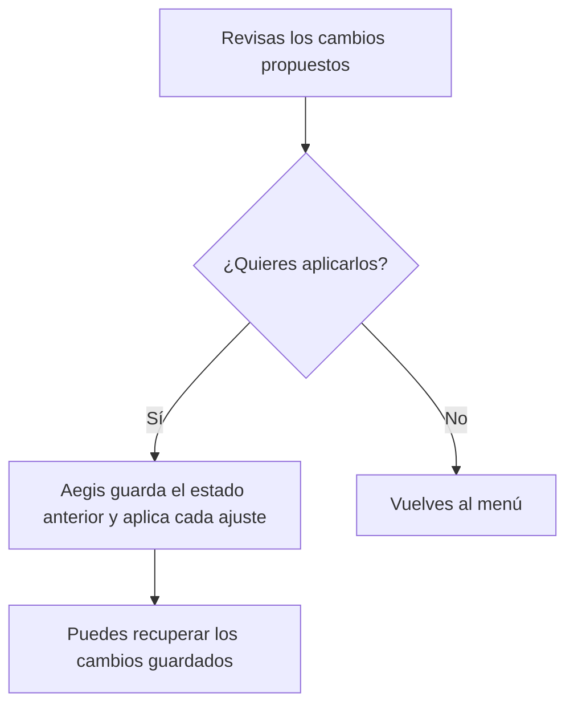

# Aegis11

Revisa ajustes de privacidad de Windows antes de cambiarlos. Aegis muestra el valor actual y el propuesto, guarda el estado anterior y permite deshacer los cambios de registro que ha guardado.

[Ver comprobaciones](https://github.com/genesisgzdev/Aegis11/actions) · [Guía de uso](docs/USO.md) · [Cómo funciona](docs/ARCHITECTURE.md)

## Qué puedes hacer

- Revisar ajustes de diagnóstico, Copilot y búsqueda web de Windows
- Decidir después de ver qué valores cambiarán
- Recuperar cambios de registro guardados por Aegis
- Guardar una copia de los ajustes compatibles para compararlos

El menú de privacidad no desinstala aplicaciones ni bloquea las actualizaciones de Edge. El efecto de algunas políticas depende de la edición de Windows.

## Abrir Aegis

Necesitas Windows y el ejecutable `Aegis11.exe` compilado a partir de esta versión del código. Si descargas una versión publicada, comprueba su fecha y sus notas: puede contener una interfaz anterior.

Abre el ejecutable. Verás tres opciones:

| Opción | Qué hace |
| --- | --- |
| `1` | Muestra los ajustes de privacidad propuestos |
| `R` | Recupera los cambios guardados por Aegis |
| `0` | Cierra el programa |

La opción 1 muestra los valores antes de pedir que escribas `SI`. Cualquier otra respuesta vuelve al menú. Los cambios del equipo requieren los permisos que Windows exija; no se eluden desde Aegis.



## Consultar sin aplicar

Desde una terminal puedes leer la ayuda o ver el plan de servicios:

```powershell
.\Aegis11.exe --help
.\Aegis11.exe --preview
```

`--preview` consulta el plan de servicios. El menú muestra los ajustes de registro de privacidad. Son recorridos diferentes y la guía explica cuál elegir.

Para guardar los ajustes compatibles:

```powershell
.\Aegis11.exe --snapshot ajustes.json
```

Ese archivo sirve para comparar. No es una copia completa de Windows ni se puede usar todavía para restaurar todos sus componentes. `--apply`, `--restore` y los perfiles antiguos Balanced y Aggressive siguen sin estar disponibles.

## Compilar esta versión

Instala Visual Studio 2022 con desarrollo de escritorio en C++, Windows SDK y CMake. Desde una terminal de desarrollo de Visual Studio, dentro del repositorio:

```powershell
cmake -S . -B build -A x64
cmake --build build --config Release --parallel
ctest --test-dir build -C Release --output-on-failure
```

Busca `Aegis11.exe` dentro de la carpeta de compilación. Las pruebas de Windows comprueban compilación y comportamiento concreto del motor de recuperación; no certifican todos los cambios posibles en cualquier equipo.

Lee la [guía de uso y recuperación](docs/USO.md) antes de aplicar ajustes. El [mapa de archivos](docs/REPOSITORY_MAP.md) ayuda a recorrer el código.

Licencia [MIT](LICENSE).
