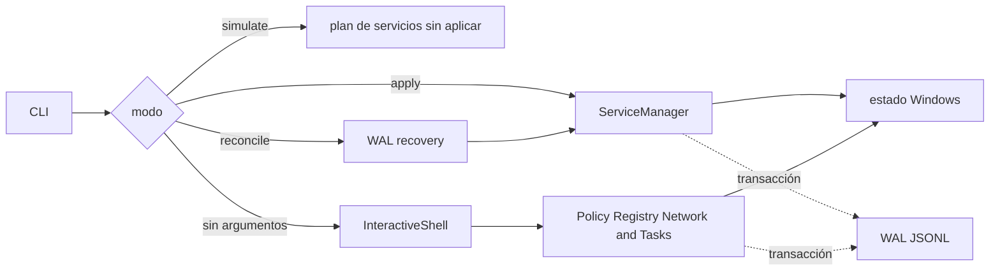

# Aegis11

[](https://isocpp.org/)
[](https://www.microsoft.com/windows/)
[](https://cmake.org/)
[](LICENSE)

Aegis11 es un controlador de políticas para Windows. Su objetivo es aplicar una configuración deseada, registrar los cambios y volver a comprobar el estado cuando el sistema se desvía de esa configuración.

En 30 segundos: `--simulate` muestra el plan de servicios, `--apply` aplica esa ruta fija y `--reconcile` recupera el WAL y vuelve a comprobar servicios y tareas. Sin argumentos abre el modo interactivo, que expone más módulos. Es una base de control de estado, no un antivirus ni un EDR certificado.

El proyecto trabaja sobre componentes sensibles de Windows como registro, servicios, tareas programadas y Windows Filtering Platform. Por eso el README separa lo que compila de lo que todavía necesita pruebas nativas en una máquina Windows aislada.

## Estado actual

- La ruta reproducible de compilación usa Visual Studio 2022, MSVC v143, Windows SDK 10.0.22000 o superior y CMake 3.21 o superior.
- GitHub Actions comprueba la compilación de Windows y los checks del repositorio.
- `--reconcile`, `--simulate` y `--apply` están expuestos por la CLI.
- `--apply` ejecuta la lista fija de servicios de `ServiceManager`; no equivale al perfil interactivo Aggressive.
- `--reconcile` recupera el WAL y vuelve a aplicar las comprobaciones de servicios y tareas que hoy implementa el código.
- `--simulate` solo muestra el plan de servicios y no simula todos los módulos interactivos.
- La ejecución con privilegios, los cambios de red y la reconciliación sobre un sistema real necesitan validación específica en Windows.
- La interfaz de snapshot y restore todavía no está implementada. El binario rechaza esas opciones para no informar un éxito falso.

Esto no es un antivirus ni un EDR terminado. Es una base de ingeniería para control de estado y mitigación en Windows.

## Flujo y límites

- `PolicyEngine` y el WAL coordinan transacciones y recuperación
- `Registry`, `Service` y `Task` inspeccionan y aplican políticas del sistema
- `NetworkWfp` y `FirewallManager` encapsulan las capas de filtrado
- `AppxManager` y `DataPurge` cubren operaciones de paquetes y limpieza
- `Reinforcement` registra la tarea de reconciliación
- `InteractiveShell` y `ArgumentParser` forman la interfaz de consola



La vista separa las rutas que realmente existen. Los nombres de módulos no son evidencia de que cada capacidad esté validada en runtime.

El WAL usa entradas JSONL con estados de transacción y validación de integridad. Las garantías concretas dependen de la implementación del módulo y deben probarse con el sistema que se vaya a modificar.

## Uso

```powershell
.\aegis11.exe --help
.\aegis11.exe --simulate
.\aegis11.exe --apply
.\aegis11.exe --reconcile
```

`--simulate` escribe en el log los servicios que se detendrían y deshabilitarían. `--apply` aplica esa misma lista. `--reconcile` recupera el WAL y ejecuta la ruta de servicios y tareas para la que existe código. El modo sin argumentos abre el perfil interactivo completo. Prueba primero en una instalación descartable y conserva una forma externa de recuperar el sistema.

## Compilar en Windows

```powershell
cmake -B build -S .
cmake --build build --config Release
ctest --test-dir build -C Release --output-on-failure
```

El proyecto es Windows-only. El job de CI demuestra que el código compila y que pasan los checks estáticos del repositorio; no prueba que una política privilegiada sea segura para cualquier máquina.

## Qué respalda cada nivel

Aegis11 puede afectar conectividad, servicios, tareas y políticas del registro. No lo ejecutes sobre equipos ajenos ni en producción sin una política revisada, una copia recuperable y una prueba de aceptación para cada módulo.

La compilación y `tests/compile_checks.py` cubren el código y el build. Las pruebas en VM Windows cubren cambios reales de registro, servicios, tareas, WFP, firewall o Appx. La recuperación necesita una prueba propia del cambio y de su reversión.

Snapshot y restore aparecen como opciones reservadas y se rechazan; no se ocultan detrás de un ejemplo que parezca operativo.

El flujo exacto por modo está en [docs/ARCHITECTURE.md](docs/ARCHITECTURE.md).

## Licencia

GPL-3.0. Consulta [LICENSE](LICENSE).
