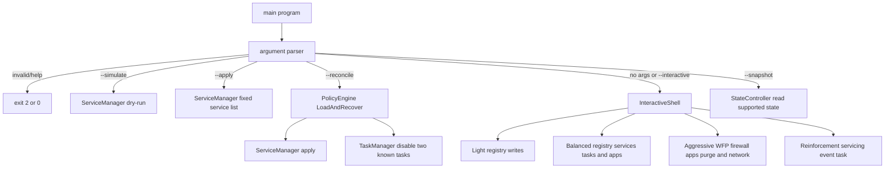
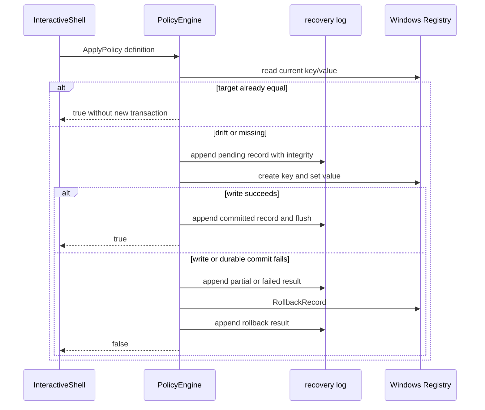
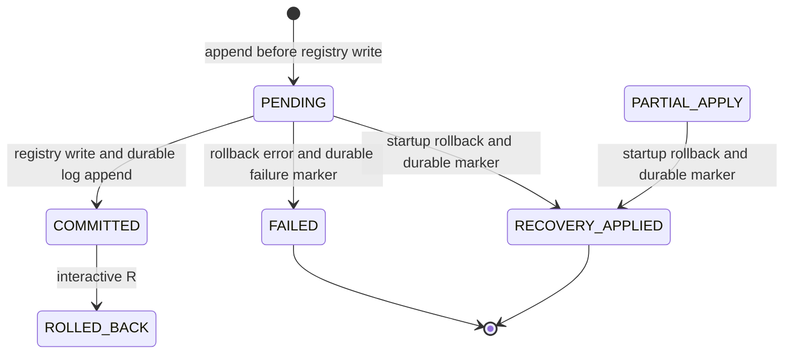

# Aegis11 architecture

Aegis11 tiene una ruta interactiva amplia y tres rutas CLI deliberadamente más estrechas. Documentarlas como si todas ejecutaran el mismo perfil sería incorrecto.

## Cómo leerlo

La primera figura es un mapa de modos, no una promesa de que todos los módulos se ejecuten juntos. La secuencia explica la única transacción con WAL documentada aquí. El cierre separa compilación de comportamiento privilegiado observado en Windows.

## 1. Enrutamiento por modo

`--snapshot <file.json>` conecta `main.cpp` con `StateController` y escribe el baseline de los servicios, tareas y valores de registro que tienen captura implementada. `--restore` sigue rechazado con exit code 3; el archivo no se presenta como mecanismo de rollback.

El parser acepta un solo modo operativo por invocación. La ruta de snapshot, simulate y apply se resuelve antes de construir `PolicyEngine`, porque su constructor carga el WAL y puede iniciar recuperación; una captura no debe entrar en esa ruta como efecto lateral.

El snapshot toma la versión y build mediante `SysInfo::GetCapabilities` y serializa primero un archivo temporal. `MoveFileExW` lo reemplaza con `MOVEFILE_WRITE_THROUGH`; si la serialización o el reemplazo falla, se elimina el temporal y no se presenta un baseline parcial como válido.

## 2. Transacción de política de registro

El WAL usa entradas alineadas a 4096 bytes, FNV-1a sobre el payload, marcador final `0xAA` y `FlushFileBuffers`. Eso describe integridad de escritura; no equivale a snapshot completo ni rollback de todos los módulos.

Las rutas de registro, Copilot y Edge no modifican DACLs como efecto lateral. La ruta de servicios solo cambia estado de ejecución e inicio; conserva recovery actions y triggers. Cada descriptor o configuración adicional solo podrá cambiarse cuando tenga captura, restauración y estado de conflicto dentro del mismo contrato de recuperación.

La desactivación de tareas exige una acción dentro de `System32` con firma digital válida. El campo `Author` del XML se trata como metadato no confiable y no autoriza una mutación.

## 3. Recuperación y persistencia

- Constructor de `PolicyEngine` llama `LoadAndRecover`; `--reconcile` lo vuelve a llamar antes de ejecutar servicios y tareas.
- El parser usa la longitud del payload para localizar el checksum; no interpreta el último separador como si fuera parte del payload.
- La reconstrucción agrupa los registros por `id` y conserva solo el último estado durable antes de decidir si debe recuperar. El `PENDING` histórico de una transacción que terminó en `COMMITTED` ya no dispara un rollback falso.
- Tras el rollback de arranque se añade un registro `RECOVERY_APPLIED` o `FAILED`, de modo que el siguiente arranque puede distinguir una recuperación terminada de una que no pudo completarse.
- Interactive `R` revierte solo registros marcados `COMMITTED`. Elimina `aegis_wal.jsonl` únicamente si todas las reversiones y sus marcas durables terminan correctamente; si una falla, conserva el journal para otro intento.
- `Reinforcement` se registra solo desde la ruta interactiva y dispara por eventos de servicing de Windows con argumento `--reconcile`. La tarea se limita a cinco minutos y usa `TASK_INSTANCES_IGNORE_NEW`; no mantiene un proceso residente ni acumula ejecuciones concurrentes.

## 4. Límite de validación

- `tests/compile_checks.py` valida contratos de repo/CMake; Windows CI valida compilación.
- No se ha demostrado aquí la ejecución privilegiada sobre registro, servicios, tareas, WFP, firewall o Appx.
- Cualquier prueba de `--apply`, perfil Aggressive o tarea de auto-reconciliación debe ejecutarse en VM/equipo Windows descartable con recuperación externa.
