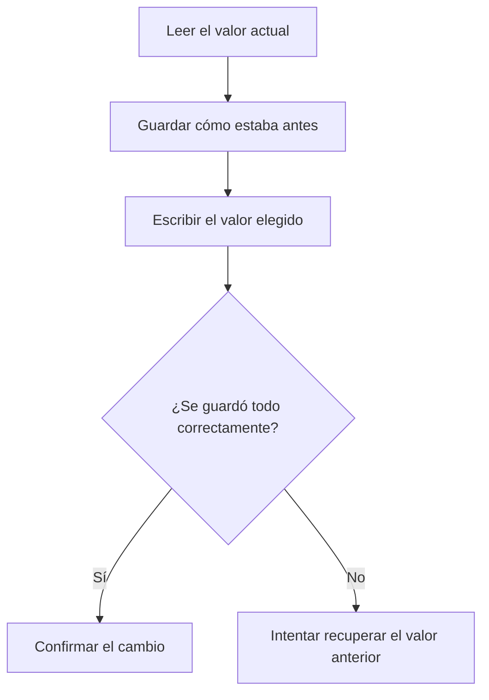

# Cómo guarda y recupera cambios Aegis

Aegis separa consultar de modificar. El menú de privacidad cambia valores de registro que puede guardar y recuperar. La copia de ajustes y el plan de servicios son consultas diferentes.

## Qué ejecuta cada entrada

| Entrada | Comportamiento |
| --- | --- |
| Sin argumentos o `--interactive` | Abre el menú de privacidad y recuperación |
| `--preview` | Consulta el plan de servicios; admite los alias anteriores |
| `--snapshot archivo.json` | Guarda los ajustes compatibles para comparar |
| `--reconcile` | Carga y recupera transacciones pendientes |
| `--apply` o `--restore` | Rechaza la operación con código 3 |

El parser admite un único modo por ejecución. Las consultas de copia y servicios se resuelven antes de construir el motor de recuperación para que no recuperen transacciones como efecto lateral.

El menú solo anuncia acciones disponibles. Conserva el rechazo de los números antiguos de Balanced y Aggressive para que una entrada antigua no termine ejecutando otro perfil. La propuesta de privacidad no añade políticas de bloqueo de actualizaciones de Edge.

## Cambiar un valor

El registro de recuperación se llama WAL porque se escribe antes del cambio. Las entradas tienen comprobación de integridad y se vacían a disco. Si guardar la confirmación falla, el motor intenta recuperar el cambio en lugar de presentarlo como completo.

Para reconstruir el estado, el motor agrupa entradas por transacción y conserva su última marca durable. Un registro antiguo de «pendiente» no revierte un cambio que después quedó confirmado.

## Recuperar sin pisar otros cambios

R intenta recuperar las transacciones confirmadas. Antes compara el valor actual con el que Aegis había escrito. Si otra herramienta lo cambió, informa un conflicto. No borra un árbol entero del registro para forzar que la recuperación parezca correcta.

El archivo de recuperación solo se elimina cuando todas las reversiones y sus marcas se guardaron correctamente. Si queda algo pendiente, se conserva para otro intento. El menú impide aplicar una propuesta mientras el proceso está en recuperación.

`--reconcile` recupera pendientes al arrancar. No equivale a R para deshacer todos los cambios confirmados. El constructor de `PolicyEngine` realiza esa recuperación una sola vez.

## Qué contiene una copia de ajustes

La copia incluye tipo y bytes de valores de registro, vista de Windows, configuración básica de servicios, dependencias y XML de tareas cuando se pueden consultar. Usa la versión real de Windows y se escribe mediante un archivo temporal antes del reemplazo.

No contiene todo el estado necesario para restaurar Windows. Un ajuste ausente o no accesible no debe confundirse con una copia completa. Por eso la restauración desde esa copia permanece deshabilitada.

## Dónde está cada responsabilidad

| Archivo | Qué revisar |
| --- | --- |
| `src/main.cpp` | Orden de arranque y separación de modos |
| `include/CLI/ArgumentParser.hpp` | Opciones y ayuda |
| `include/UI/InteractiveShell.hpp` | Propuesta, confirmación y recuperación del menú |
| `include/Core/PolicyEngine.hpp` | Guardado y recuperación de cada cambio |
| `include/Core/StateEngine.hpp` | Captura de ajustes compatibles |
| `include/Core/RAII.hpp` | Cierre y transferencia de recursos de Windows |

Las rutas de registro no cambian permisos como efecto lateral. Los módulos de servicios conservan sus acciones de recuperación y disparadores. Las tareas requieren una acción firmada dentro de System32; el campo Author no autoriza cambios. La tarea automática de refuerzo no se registra mientras carezca de recuperación completa.

## Cómo se comprueba

CI compila Debug y Release con advertencias tratadas como errores. Las pruebas nativas comprueban transacciones, recuperación y manejo de recursos de Windows. Compilar estos módulos no demuestra todos sus efectos sobre una instalación real. Las futuras operaciones de servicios, tareas y aplicaciones deben probar su recuperación completa antes de aparecer como disponibles.

[Guía de uso](USO.md) · [Mapa de archivos](REPOSITORY_MAP.md)
